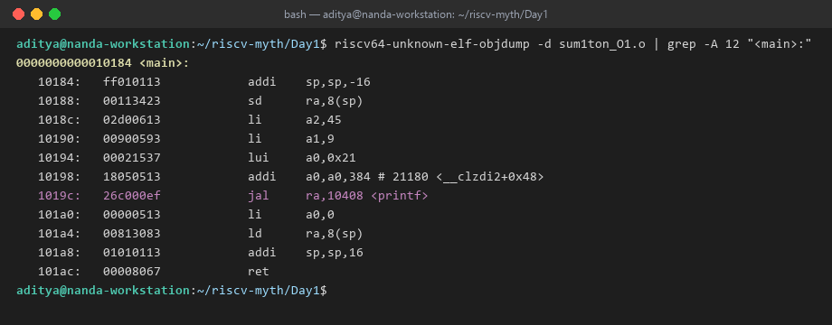
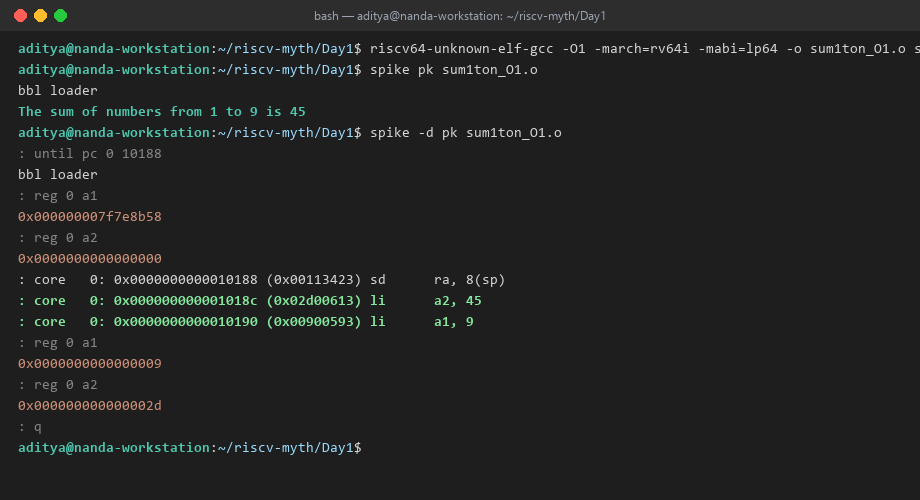
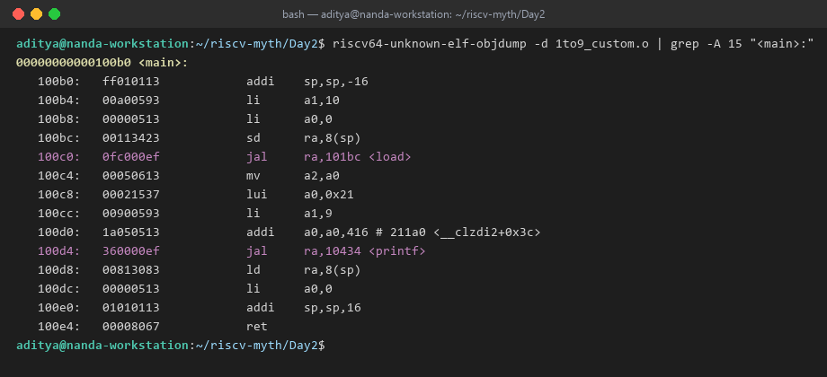
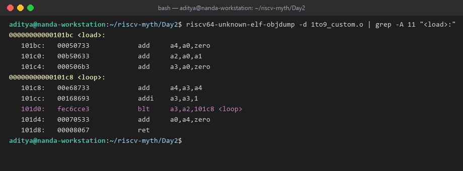
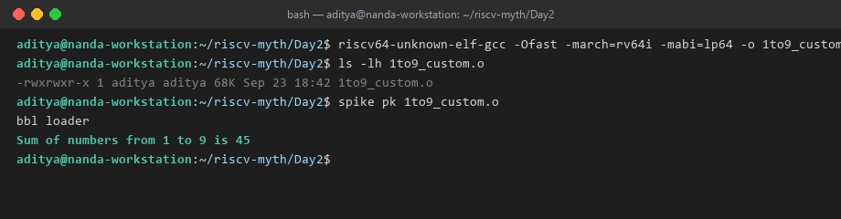

# Day 1 & 2 Technical Report: Compiler Toolchain, ISA Emulation & ABI Mechanics

**Author:** [Aditya Nanda](https://github.com/TotallyNotAditya17)  
**Platform:** VSDIAT RISC-V MYTH Workshop  

This module details the software-to-hardware compilation flow targeting the RISC-V 64-bit architecture (`rv64i`), binary inspection via GNU utilities, cycle execution on the Spike ISA emulator, and custom ABI function linkage verified on the synthesizable PicoRV32 processor core.

---

## Section Index
1. [RISC-V Toolchain Compilation & Assembly Exploration](#1-risc-v-toolchain-compilation--assembly-exploration)
2. [Spike Architectural Simulation & Interactive Debugging](#2-spike-architectural-simulation--interactive-debugging)
3. [64-bit Numerical Representation & Boundary Behavior](#3-64-bit-numerical-representation--boundary-behavior)
4. [Application Binary Interface (ABI) Calling Convention](#4-application-binary-interface-abi-calling-convention)
5. [Hardware Emulation on Synthesizable PicoRV32 Core](#5-hardware-emulation-on-synthesizable-picorv32-core)

---

## 1. RISC-V Toolchain Compilation & Assembly Exploration

The initial investigation centers around compilation optimization behavior using the GNU RISC-V cross-compiler (`riscv64-unknown-elf-gcc`).

### Source Implementation (`Lab1/sum1ton.c`)
```c
// ============================================================================
// VSDIAT RISC-V MYTH Workshop - Lab 1: C Program to Sum 1 to N
// Author: Aditya Nanda (TotallyNotAditya17)
// ============================================================================
#include <stdio.h>

int main() {
    int i, sum = 0, n = 9;
    for (i = 1; i <= n; i++) {
        sum += i;
    }
    printf("The sum of numbers from 1 to %d is %d\n", n, sum);
    return 0;
}
```

### Compiler Optimization Analysis: `-O1` vs `-Ofast`
Commands executed on the developer workstation:
```bash
# RV64I baseline cross-compilation with standard O1 optimization
riscv64-unknown-elf-gcc -O1 -march=rv64i -mabi=lp64 -o sum1ton_O1.o sum1ton.c

# Aggressive Ofast optimization
riscv64-unknown-elf-gcc -Ofast -march=rv64i -mabi=lp64 -o sum1ton_Ofast.o sum1ton.c

# Inspecting disassembly
riscv64-unknown-elf-objdump -d sum1ton_O1.o | grep -A 12 "<main>:"
```

#### Assembly Disassembly


*Key Findings:*
* Under `-O1`, the compiler avoids a runtime arithmetic loop by pre-calculating the sum constant directly at compile time (`li a2, 45`).
* Register `a1` holds the upper loop index ($n = 9$), while register `a0` holds the pointer address for the format string before calling `printf`.

---

## 2. Spike Architectural Simulation & Interactive Debugging

The Spike simulator executes the compiled ELF binary using the Berkeley Boot Loader (`pk` proxy kernel).

```bash
# Functional execution
spike pk sum1ton_O1.o

# Interactive debugger launch
spike -d pk sum1ton_O1.o
```



### Step-by-Step Register Tracking
* `: until pc 0 10188` — Runs emulation up to the stack setup instruction in `main`.
* `: reg 0 a1` & `: reg 0 a2` — Verifies initial register values before instruction execution.
* After single-stepping through PC `0x1018c` and `0x10190`:
  * Register `a1` loads immediate value `0x09` ($9$).
  * Register `a2` loads immediate value `0x2d` ($45$).

---

## 3. 64-bit Numerical Representation & Boundary Behavior

To examine how 64-bit signed and unsigned integer boundaries behave under RISC-V arithmetic:
* `Lab2/unshighlow.c`: Analyzes unsigned range boundaries ($0$ to $2^{64}-1$).
* `Lab2/signhighlow.c`: Evaluates two's-complement overflow behavior around $-2^{63}$ and $2^{63}-1$.

---

## 4. Application Binary Interface (ABI) Calling Convention

The RISC-V ABI defines strict architectural rules for parameter passing, return values, and register preservation across function calls:


### C Wrapper & Assembly Function Co-operation
A custom C application (`Lab3/1to9_custom.c`) interfaces with a handcrafted RISC-V assembly sub-routine (`Lab3/load.S`):

* **Caller (`1to9_custom.c`):** Sets up function arguments in registers `a0` ($0$) and `a1` ($10$), then invokes `load` using jump-and-link (`jal ra, 101bc <load>`).
  

* **Callee Subroutine (`load.S`):** Accumulates the sum in temporary accumulator `a4` through a conditional branch loop (`blt a3, a2, loop`), and returns the final value in `a0`.
  

* **Execution Verification:**
  ```bash
  riscv64-unknown-elf-gcc -Ofast -march=rv64i -mabi=lp64 -o 1to9_custom.o 1to9_custom.c load.S
  spike pk 1to9_custom.o
  ```
  

---

## 5. Hardware Emulation on Synthesizable PicoRV32 Core

To bridge the software binary with physical hardware design, the compiled C and assembly code is loaded into an instantiated **PicoRV32** CPU core and verified with Icarus Verilog (`iverilog`).

### Script Flow (`Lab4/rv32im.sh`)
```bash
cd Lab4
chmod +x rv32im.sh
./rv32im.sh
```

**Automated Steps:**
1. Cross-assembles `start.S` (reset handler) and `load.S`.
2. Compiles `1to9_custom.c` and low-level system calls `syscalls.c`.
3. Links with `riscv.ld` into `firmware.elf`.
4. Converts binary instructions into 32-bit hex words via `hex8tohex32.py`.
5. Compiles and executes `testbench.v` with `picorv32.v`.
6. Validates hardware register output against expected computation ($45$).

---

## 👨‍💻 Module Author
* **Aditya Nanda** — [GitHub Profile](https://github.com/TotallyNotAditya17)
