# Days 3–5 Technical Report: Digital Logic, Microarchitecture & 5-Stage RV32I Processor in TL-Verilog

**Author:** [Aditya Nanda](https://github.com/TotallyNotAditya17)  
**Platform:** Redwood EDA / Makerchip TL-Verilog  

This section documents the progressive hardware development from basic digital logic circuits to a complete, pipelined **RV32I RISC-V processor core** modeled using **Transaction-Level Verilog (TL-Verilog)** in the **Makerchip** virtual prototyping environment.

---

## 📑 Module Sections
1. [Day 3: Digital Circuits & Pipelined Calculator Design](#1-day-3-digital-circuits--pipelined-calculator-design)
2. [Day 4: Single-Cycle RV32I Datapath & Control Architecture](#2-day-4-single-cycle-rv32i-datapath--control-architecture)
3. [Day 5: 5-Stage Pipeline Integration & Hazard Resolution](#3-day-5-5-stage-pipeline-integration--hazard-resolution)
4. [Verification Assertions & Test Results](#4-verification-assertions--test-results)

---

## 1. Day 3: Digital Circuits & Pipelined Calculator Design

TL-Verilog abstracts flip-flops and timing stages using the `@` pipeline stage construct, dramatically reducing RTL boilerplate.

### Combinational Calculator (`combinational_calculator.tlv`)
Performs 32-bit arithmetic (`+`, `-`, `*`, `/`) selected via opcode bits:
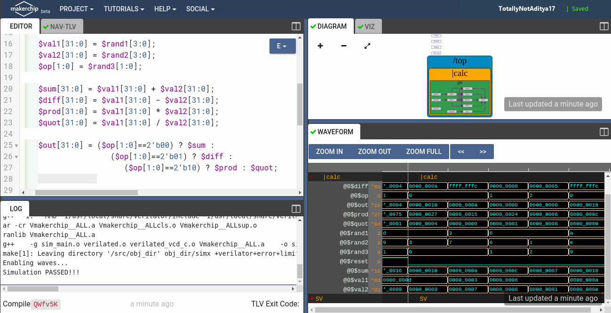

### Sequential Feedback Calculator (`sequential_calculator.tlv`)
Maintains an internal state accumulator across clock ticks, operating sequentially on successive randomized inputs:
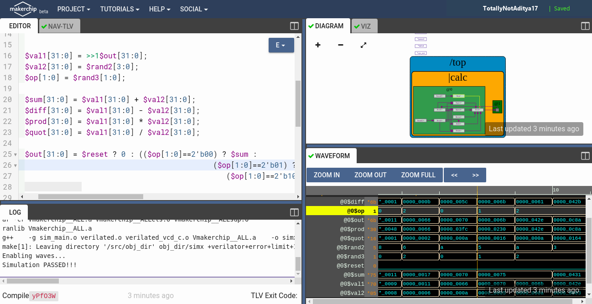

### Pipelining & Transaction Validity (`cycle_calculator_validity.tlv`)
Splits the computational path across cycle stages (`@1` input capture, `@2` computation & commit) while guarding state updates using the validity condition (`?$valid`):
* Single Value Memory: [`calculator_singleValueMemory.tlv`](calculator_singleValueMemory.tlv)
* Reference Solution: [`calculator_solutions.tlv`](calculator_solutions.tlv)

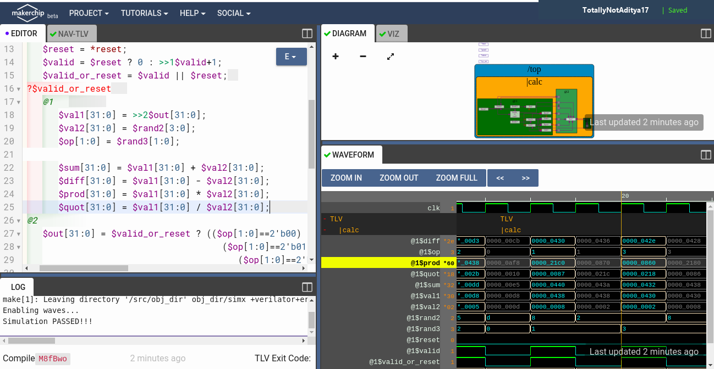

---

## 2. Day 4: Single-Cycle RV32I Datapath & Control Architecture

The processor core is constructed block-by-block following the official RISC-V RV32I base integer specification:

### Instruction Fetch (IF)
Generates the next Program Counter (`$pc`), fetches 32-bit instruction words from Instruction Memory (`$imem_rd_data`), and increments `$pc` by 4 bytes:
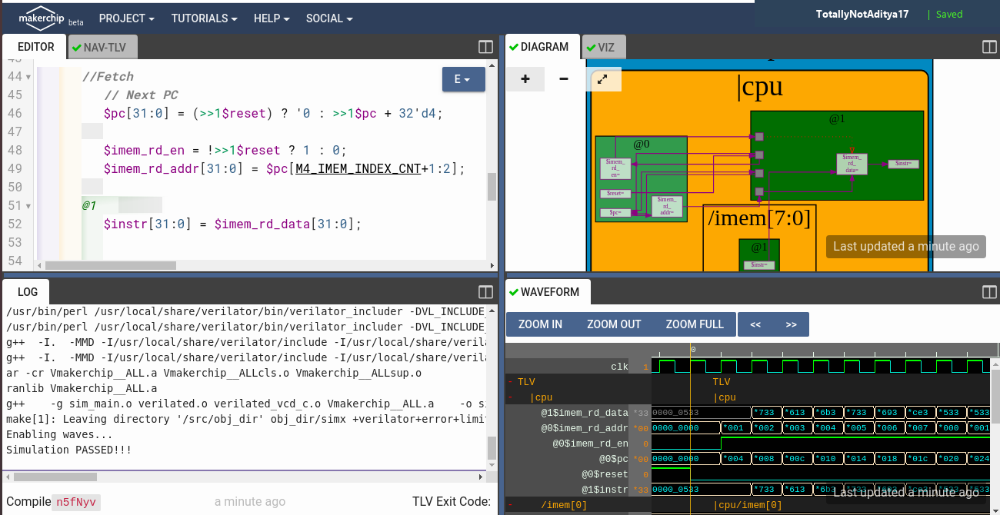

### Instruction Decode (ID)
Extracts immediate fields (`$imm`) and decodes instruction categories:
* R-type (Register-to-Register)
* I-type (Register-Immediate & Loads)
* S-type (Stores)
* B-type (Conditional Branches)
* U-type (Upper Immediates)
* J-type (Unconditional Jumps)

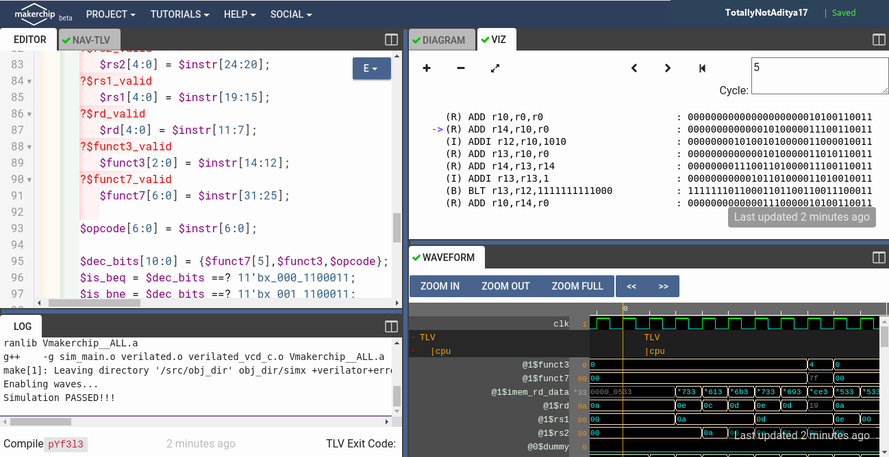

### Register File Architecture
* **Dual Read Ports:** Asynchronously read source operands `rs1` and `rs2`:
  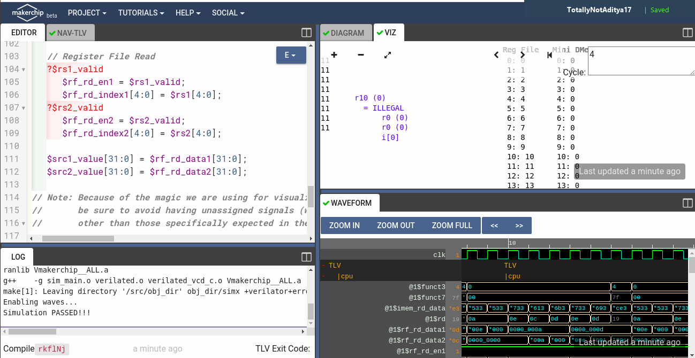
* **Single Write Port:** Synchronously commits results into destination register `rd`:
  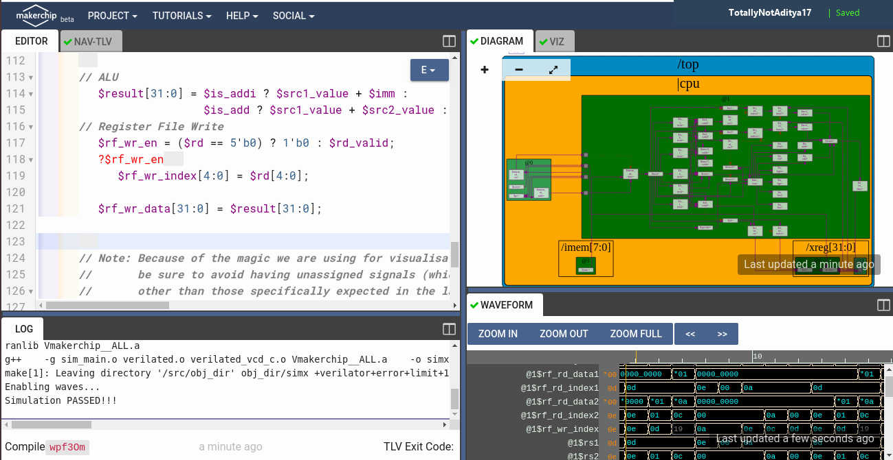

### ALU & Branch Control Logic
The Arithmetic Logic Unit evaluates arithmetic, logical, and shift instructions, while the branch decision block evaluates conditional comparisons (`BEQ`, `BNE`, `BLT`, `BGE`):
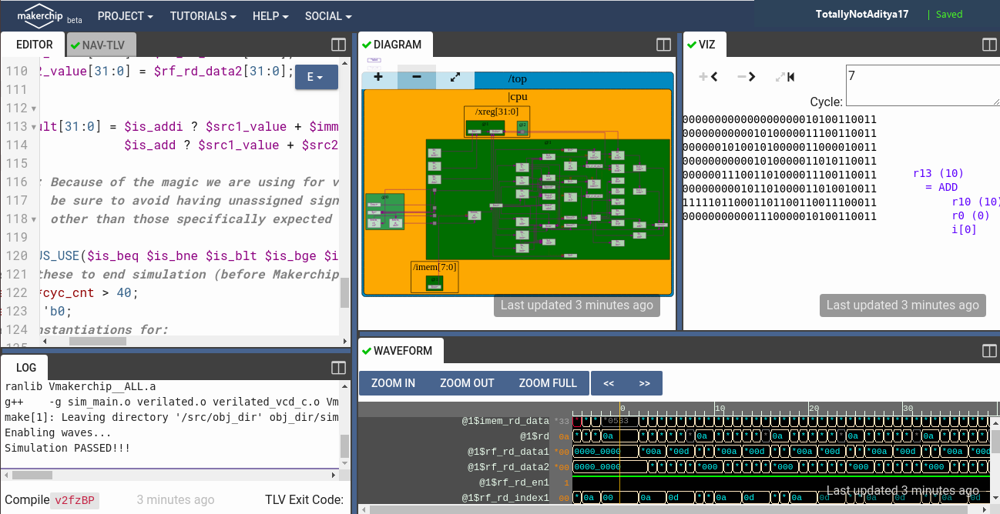
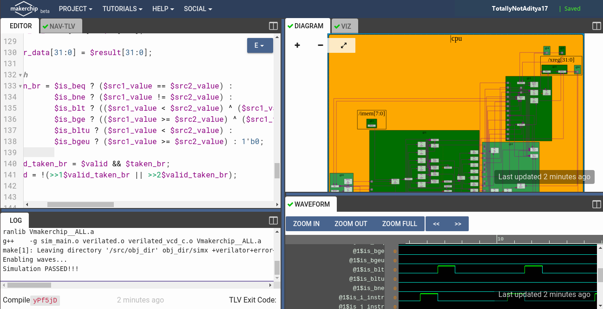

---

## 3. Day 5: 5-Stage Pipeline Integration & Hazard Resolution

The single-cycle core is refactored into a **5-stage pipeline** (`Day3_5/risc-v_solutions.tlv`):

$$\text{Fetch (@1)} \longrightarrow \text{Decode (@2)} \longrightarrow \text{Execute (@3)} \longrightarrow \text{Memory (@4)} \longrightarrow \text{Write-Back (@5)}$$

### Data Hazard Mitigation (2-Source Bypass Forwarding)
To resolve Read-After-Write (RAW) data dependencies between producer instructions and consumer instructions without stalling:
* Results from stage `@4` (Memory) and stage `@5` (Write-Back) are forwarded directly to the ALU inputs at stage `@3`.

### Branch Penalty & Redirection
When a conditional branch or jump is taken at stage `@3`, the fetch PC at stage `@1` is redirected to the computed target address, and instructions in stages `@1` and `@2` are invalidated via the branch flush condition (`$valid_taken_branch`).

### Data Memory Interface
Integrates load (`LW`) and store (`SW`) memory accesses to Data Memory (DMem):
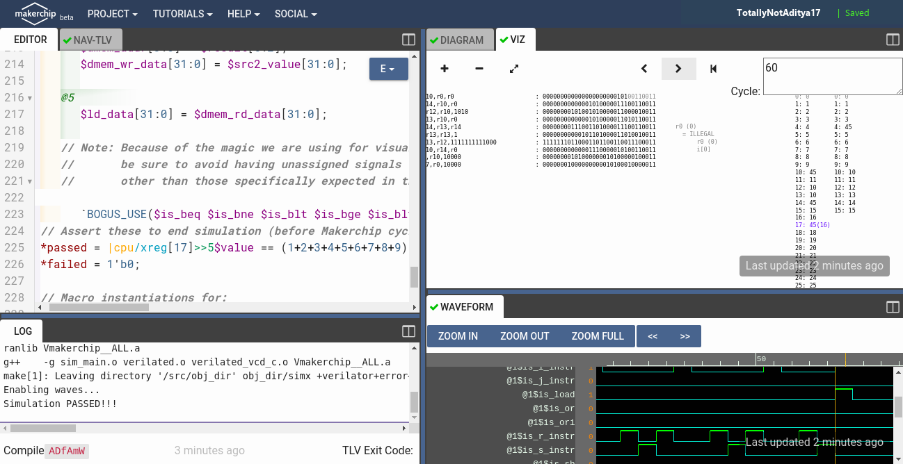

### Pipelined Core Datapath
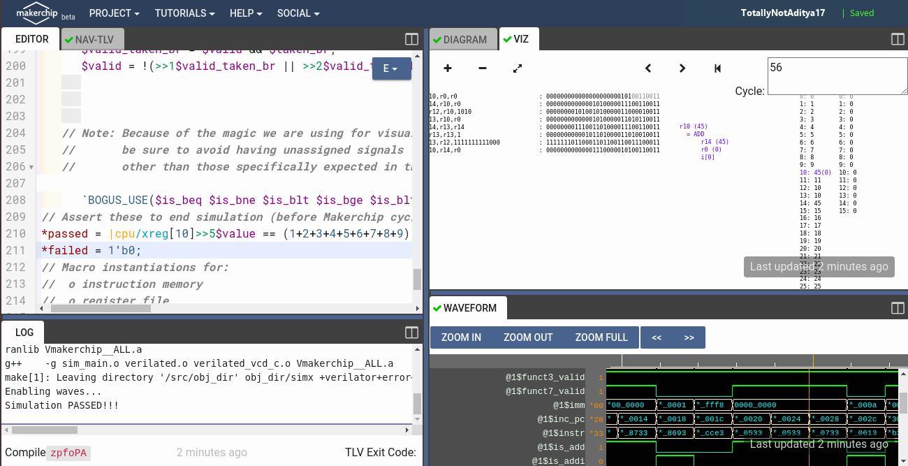

---

## 4. Verification Assertions & Test Results

The verified design executes an in-memory assembly testbench that performs a loop accumulating integers $1$ through $9$. The final cumulative value ($45 = \text{0x2d}$) is written to register `x10`.

```text
*passed = |cpu/xreg[10]>>5$value == (1+2+3+4+5+6+7+8+9);
```

When this condition is satisfied, the Makerchip simulation logs output `Simulation PASSED!!!`:

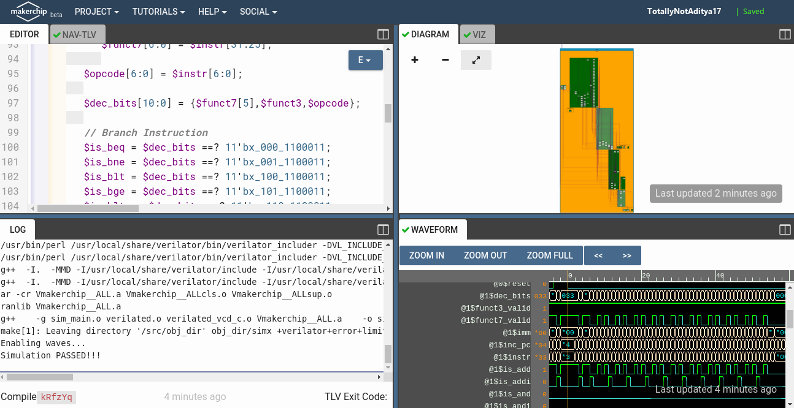

---

## 👨‍💻 Module Author
* **Aditya Nanda** — [GitHub Profile](https://github.com/TotallyNotAditya17)
