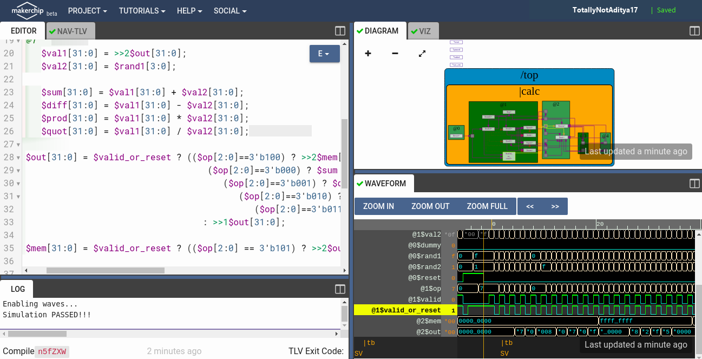

# RISC-V MYTH Workshop: 5-Stage RV32I Core & Hardware Labs
> **Microprocessor for You in Thirty Hours (MYTH) Workshop**  
> Organized by **VLSI System Design (VSD)** & **Redwood EDA**  
> **Author:** [Aditya Nanda](https://github.com/TotallyNotAditya17) (`TotallyNotAditya17`)

---

## 📋 Overview
This repository contains the complete laboratory implementations, source code, verification testbenches, and hardware models developed during the 5-day **RISC-V MYTH Workshop**. The curriculum covers the end-to-end journey from high-level C programming, compiler optimization, and assembly language execution on the Spike ISA simulator to architecting, pipelining, and verifying a synthesizable **5-stage RISC-V (RV32I) CPU core** using **Transaction-Level Verilog (TL-Verilog)** on the **Makerchip** platform.

---

## 📑 Table of Contents
1. [Day 1: Introduction to RISC-V ISA and GNU Toolchain](#-day-1-introduction-to-risc-v-isa-and-gnu-toolchain)
2. [Day 2: Application Binary Interface (ABI) & Microprocessor Execution](#-day-2-application-binary-interface-abi--microprocessor-execution)
3. [Day 3: Digital Logic & Arithmetic Circuits in TL-Verilog](#-day-3-digital-logic--arithmetic-circuits-in-tl-verilog)
4. [Day 4: Microarchitecture Design & Basic RISC-V Core](#-day-4-microarchitecture-design--basic-risc-v-core)
5. [Day 5: Pipelined RV32I Processor with Hazard Handling](#-day-5-pipelined-rv32i-processor-with-hazard-handling)
6. [Repository Structure](#-repository-structure)
7. [Author & Acknowledgements](#-author--acknowledgements)

---

## 🚀 Day 1: Introduction to RISC-V ISA and GNU Toolchain

### 1. C Code Compilation with RISC-V GCC
A basic C program calculating the summation of integers from 1 to $N$ (`Day2/Lab1/sum1ton.c`) was compiled with different optimization flags (`-O1` and `-Ofast`) targeting the 64-bit RISC-V base architecture (`rv64i` with `lp64` ABI):

```bash
riscv64-unknown-elf-gcc -O1 -march=rv64i -mabi=lp64 -o sum1ton_O1.o sum1ton.c
riscv64-unknown-elf-gcc -Ofast -march=rv64i -mabi=lp64 -o sum1ton_Ofast.o sum1ton.c
```

### 2. Disassembly & Instruction Optimization Analysis
The generated binary files were disassembled using `riscv64-unknown-elf-objdump` to examine how GCC optimizes assembly routines:

```bash
riscv64-unknown-elf-objdump -d sum1ton_O1.o | grep -A 12 "<main>:"
```


*Observation:* With `-O1`, the compiler generates assembly instructions that compute the sum iteratively or compute the direct result into registers `a2` ($45 = \text{0x2d}$) and `a1` ($9$) before invoking `printf`.

### 3. Simulation & Interactive Debugging with Spike
The compiled binary was simulated using the **Spike ISA simulator** with the Berkeley Boot Loader proxy kernel (`pk`). Step-by-step register states were verified using Spike's interactive debug mode (`-d`):

```bash
spike pk sum1ton_O1.o
spike -d pk sum1ton_O1.o
```


---

## ⚙️ Day 2: Application Binary Interface (ABI) & Microprocessor Execution

### 1. RISC-V Register Calling Conventions
The RISC-V ABI defines standard register roles to ensure seamless interoperability between C code and assembly routines:


### 2. C Program Calling Custom Assembly Routine
An assembly function `load` (`Day2/Lab3/load.S`) was authored to implement a loop-based summation, called directly by a C wrapper (`Day2/Lab3/1to9_custom.c`). Arguments are passed in registers `a0` and `a1`, and the computed result is returned in `a0`:

* **Main Function Disassembly:**
  

* **Assembly Subroutine `load` Disassembly:**
  

* **Execution Output on Spike:**
  

### 3. Verification on Synthesizable PicoRV32 Core
The custom assembly routine and C program were converted into hex memory images (`hex8tohex32.py`) and simulated on the synthesizable **PicoRV32** Verilog core using Icarus Verilog:

```bash
cd Day2/Lab4
chmod +x rv32im.sh
./rv32im.sh
```

---

## 🧮 Day 3: Digital Logic & Arithmetic Circuits in TL-Verilog

Digital logic circuits and sequential state machines were designed using **Transaction-Level Verilog (TL-Verilog)** in the **Makerchip** cloud IDE.

* **Combinational Calculator:**
  Implements 32-bit addition, subtraction, multiplication, and division based on a 2-bit operation selector:
  

* **Sequential / Cyclic Calculator:**
  Incorporates feedback state registers and valid transaction gating:
  

* **2-Cycle Pipelined Calculator:**
  Demonstrates retiming and pipelining across cycles:
  
  

---

## 🔍 Day 4: Microarchitecture Design & Basic RISC-V Core

A single-cycle RISC-V processor was developed following the RV32I specification:

* **Instruction Fetch (IF):** Program Counter (PC) logic fetching from instruction memory:
  

* **Instruction Decode (ID):** Decoding R, I, S, B, U, and J instruction formats:
  

* **Dual-Port Register File Read:** Reading source operands `rs1` and `rs2`:
  

* **Arithmetic Logic Unit (ALU):** Executing arithmetic and logical operations:
  

* **Register File Write-Back:** Writing ALU or memory results into destination register `rd`:
  

* **Branch Target & Control Logic:** Resolving branch condition targets:
  

---

## 🏎️ Day 5: Pipelined RV32I Processor with Hazard Handling

The single-cycle core was upgraded to a **5-stage pipelined RV32I CPU core** (`Day3_5/risc-v_solutions.tlv`):

```
Stage 1: Fetch (@1)
Stage 2: Decode (@2)
Stage 3: Execute (@3)
Stage 4: Memory (@4)
Stage 5: Write-Back (@5)
```

### Key Architectural Enhancements
1. **2-Source Bypass Data Forwarding:** Resolves Read-After-Write (RAW) data hazards by bypassing results directly from `@4` (Memory) and `@5` (Write-Back) into `@3` (Execute).
2. **Branch Hazard Resolution:** Redirects fetch address and invalidates subsequent in-flight instructions upon taken branches.
3. **Data Memory (DMem) Integration:** Supports load (`LW`) and store (`SW`) memory operations:
   

4. **Pipelined Datapath Schematic:**
   

### Final Simulation Verification
The core runs an assembly testbench calculating the summation of numbers 1 to 9 ($= 45$ / `0x2d` in register `x10`), verified via assertions:

```text
*passed = |cpu/xreg[10]>>5$value == (1+2+3+4+5+6+7+8+9);
```


---

## 📁 Repository Structure
```
riscv-myth-workshop/
├── Day2/
│   ├── Lab1/              # C program sum1ton.c and compilation tests
│   ├── Lab2/              # Boundary test cases and data type limits
│   ├── Lab3/              # Custom assembly load.S and C wrapper 1to9_custom.c
│   ├── Lab4/              # Synthesizable PicoRV32 simulation suite (rv32im.sh)
│   └── README.md          # Comprehensive Day 1 & Day 2 documentation
├── Day3_5/
│   ├── basicgates.tlv     # Elementary logic gate models
│   ├── inverter.tlv       # Inverter circuit
│   ├── combinational_calculator.tlv  # Combinational ALU
│   ├── sequential_calculator.tlv     # Calculator with memory
│   ├── pipeline.tlv       # 3-cycle pipelining example
│   ├── risc-v_solutions.tlv          # 5-stage pipelined RV32I core
│   └── README.md          # Comprehensive Day 3, 4 & 5 documentation
├── Images/                # 19 simulation waveforms, schematics, and terminal logs
├── calculator_shell.tlv   # Starter shell for calculator labs
├── risc-v_shell.tlv       # Starter shell for RISC-V core labs
└── README.md              # Workshop master documentation
```

---

## 👨‍💻 Author
* **Aditya Nanda** — [GitHub Profile (@TotallyNotAditya17)](https://github.com/TotallyNotAditya17)

---

## 🤝 Acknowledgements
* **Kunal Ghosh**, Co-founder, VLSI System Design (VSD) Corp. Pvt. Ltd.
* **Steve Hoover**, Founder & CEO, Redwood EDA.
* **Shivam Potdar**, CPU Performance Engineer, Workshop Contributor.
